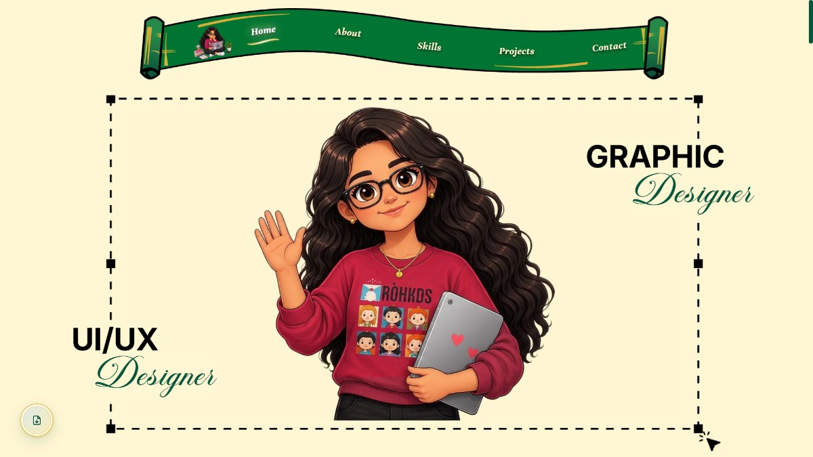

# ✨ Rifana — Designer Portfolio 🎨

[](https://rifana-designer.vercel.app/)
[](https://nextjs.org/)
[](https://react.dev/)
[](https://www.typescriptlang.org/)
[](https://threejs.org/)
[](https://motion.dev/)
[](https://tailwindcss.com/)

---

## 🌟 Overview

Welcome to the official repository for **Rifana's Portfolio** — an immersive, bespoke web experience built from scratch for a talented **UI/UX and Graphic Designer**.

This isn't just a regular portfolio with static grids; it is an interactive design playground engineered to showcase craftsmanship, visual storytelling, and technical finesse. Every interaction — from the draggable hero badge to the physics-driven 3D globe and smooth shared-layout card expansions — was tailored to leave a lasting impression on clients, design leads, and engineering teams alike.

🌐 **Live Experience:** [https://rifana-designer.vercel.app/](https://rifana-designer.vercel.app/)

---

## 📸 Preview



---

## 💎 Key Highlights & Interactive Features

### 🎬 1. Cinematic Preloader & Session Handoff
- Smooth, choreographed intro sequence that welcomes visitors on their initial visit.
- Session-aware caching prevents repeated preloader interruptions during intra-site navigation.
- Seamlessly hands off focus to the fixed header navigation upon completion.

### 🎯 2. Hero Section with Interactive Draggable Badge & Video Reveal
- **Draggable SVG Stamp**: An interactive physics-enabled SVG emblem that users can toss, pull, and drag across the screen with boundary constraints and inertia.
- **Dynamic Text Reveal**: Typography reveals using dual font pairings (**Unna** serif and **The Nautigal** cursive script).
- **Responsive Video Reveal**: Video preview card synchronized with the hero interaction.

### 👤 3. Profile & Career Milestones
- Structured timeline detailing education (B.E. in Computer Science with AI/ML, 9.05 CGPA), professional experience, and design leadership.
- Clean typography hierarchy balancing corporate authority and personal warmth.

### 💥 4. Radial Skill Explosion & Dynamic Tooltips
- Interactive skill showcase where design and development tool avatars explode radially outward from a central avatar upon entering the viewport.
- Custom elastic spring physics with staggered timing.
- Hover tooltips reveal tool names, designations, and expertise levels.

### 📂 5. Multi-Category Project Showcase
Dedicated, customized presentation templates tailored to each discipline:

| Category | Slug | Presentation Mode | Key Highlights |
|:---|:---|:---|:---|
| **UI/UX** | `/projects/uiux` | 3D Interactive Tilt Cards + Case Studies | Web & Mobile sections with interactive 3D perspective tilt and Figma prototype embeds |
| **Book Covers** | `/projects/book-covers` | Portrait 2:3 Editorial Cards | In-place shared-layout expansion revealing book synopsis, author meta, and tags |
| **Little Logos** | `/projects/little-logos` | Square 1:1 Monogram Grid | Clean grid with in-place expandable modal cards showcasing monogram geometry |
| **Branding** | `/projects/branding` | Dedicated Route Navigation | In-depth case studies with brand boards, anatomy breakdowns, and flex-wrap galleries |
| **Social Media** | `/projects/social-media` | Sub-Category Driven Showcase | Portrait cards for **Instagram Posts** & widescreen 16:9 cards for **YouTube Thumbnails** |
| **Poster** | `/projects/poster` | Curated Visuals | Creative poster designs exploring typography, composition, and visual impact |

### 🎴 6. Expandable Shared-Layout Cards (`ExpandableCard`)
- Custom-built shared-layout card system powered by **Motion**.
- Non-bouncy, tuned cubic-bezier transition curves (`[0.4, 0, 0.2, 1]`) ensuring rock-solid stability in both development and production.
- Isolated layout groups prevent layout collision across multiple sections.

### 🌍 7. Interactive 3D Globe with Three.js & React Three Fiber
- Photorealistic 3D Earth globe with bump-mapped relief textures, custom lighting, and smooth auto-rotation.
- **Accurate Chennai Location Marker**: Anchored directly to Chennai, India's geographic latitude/longitude with an interactive HTML pin card.
- **Touch-Friendly Compact Canvas**: Engineered with exact perspective camera distance formulas so mobile visitors can scroll past without accidental touch-trapping.

### 📄 8. Integrated Resume Viewer Modal
- Instant overlay drawer allowing recruiters and clients to preview, zoom, and download Rifana's professional resume without leaving the page.

---

## 🛠️ Tools & Tech Stack

### 💻 Core Technologies
- **Framework:** [Next.js 16](https://nextjs.org/) (App Router, Turbopack, Server & Client Components)
- **Language:** [TypeScript 5](https://www.typescriptlang.org/) (Strict type-safety, zero `any` policy)
- **UI Library:** [React 19](https://react.dev/)

### 🎨 Styling & Design System
- **Styling:** [Tailwind CSS v4](https://tailwindcss.com/) + Pure CSS Design Tokens
- **Typography:**
  - `Unna` — Elegant, classical serif display
  - `Inter` — High-legibility modern sans-serif
  - `The Nautigal` — Expressive cursive script accent
- **Color Palette:** Warm cream parchment (`#fff6d3`), Forest emerald (`#07553D`), Antique gold (`#987400`), and Deep charcoal (`#111111`)

### ⚡ Animation & 3D Graphics
- **Motion Engine:** [Motion v13](https://motion.dev/) (formerly Framer Motion)
- **Physics & Timelines:** [GSAP 3](https://greensock.com/gsap/)
- **3D Canvas:** [Three.js](https://threejs.org/) + [@react-three/fiber](https://docs.pmnd.rs/react-three-fiber/)
- **3D Helpers:** [@react-three/drei](https://github.com/pmndrs/drei) (`OrbitControls`, `Html` markers)

### 📦 Utilities & Primitives
- **Icons:** [Lucide React](https://lucide.dev/)
- **Forms & Validation:** [React Hook Form](https://react-hook-form.com/) + [Zod](https://zod.dev/)
- **Components:** [Radix UI](https://www.radix-ui.com/) primitives

---

## 🎬 Animation Sequence Breakdown

```
[ Visitor Lands ]
       │
       ▼
[ Preloader Stage ] ──────► Brand initials fade in ──► Line progression ──► Smooth collapse
       │
       ▼
[ Hero Activation ] ─────► Dia text reveal ──► Draggable SVG badge settles ──► Video frame fades in
       │
       ▼
[ Scroll Trigger ] ──────► Radial skill explosion expands avatars outward with spring physics
       │
       ▼
[ Project Grids ] ───────► 3D card tilt on hover / in-place smooth modal expansion on click
       │
       ▼
[ Contact Globe ] ───────► 3D Earth auto-rotates with Chennai pin anchored to coordinates
```

---

## 📱 Responsive Design Matrix

The entire portfolio is engineered to adapt fluidly across all screen sizes:

- 📱 **Mobile Portrait (320px – 480px):** Single-column layouts, touch-friendly tap targets, optimized canvas bounds, and 2-column portrait editorial grids.
- 📱 **Mobile Landscape / Phablet (481px – 767px):** Proportional scaling, compact modal dialogs, and natural font-size clamping.
- 💻 **Tablet (768px – 1023px):** Balanced 2-column and 3-column project grids, touch drag gestures, and stacked hero presentation.
- 🖥️ **Desktop & Ultrawide (1024px – 1920px+):** Full multi-column grids (up to 4 columns), rich 3D card tilt effects, radial skill explosion, and full-width branding case study showcases.

---

## 📄 License & Credits

- **Designed for:** [Rifana](https://rifana-designer.vercel.app/) — UI/UX & Graphic Designer
- **Engineered with:** ❤️ and precision using Next.js, React 19, Three.js, and Motion.
- **License:** Proprietary / All rights reserved by the creator.
